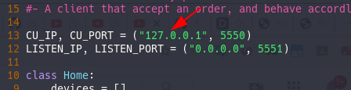

### Installation

smartgrid requires [Python3](https://www.python.org/downloads/) to run.

##### Server
Install the dependencies and  start the server.

```sh
$ cd smartgrid
$ pip3 install -r requirements.txt
$ cd GridControlUnit
$ python3 ./GridController.py
```
start the matplotlib graph dashboard on server side
```sh
$ cd smartgrid
$ python3 ./graph.py
```

Controlling clients,
from the server prompt, operator can type help
and get access to list commands used to control
devices remotely.
```sh
(command)> help
```

#### Client
Install the dependencies
```sh
$ cd smartgrid
$ pip3 install -r requirements.txt
```
Configure the client

Open **Home/Home.py** with your preferred text editor
and edit CU_IP to contain the IP address of your server




Run client,
```sh
$ cd Home
$ python3 ./Home.py
```

Client can be run independently of server code in any machine
of the network.

Server supports multiple clients connecting to it


